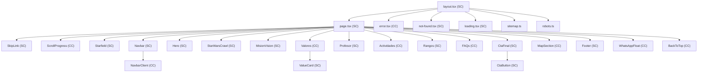
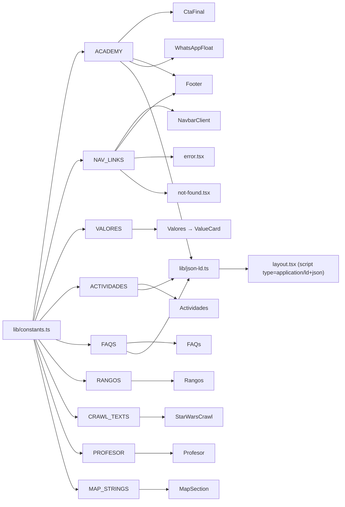

# Architecture: Ludo Sport Drake Academy

> Internal codebase reference for developers working on the project.

## App Router Hierarchy



The root `layout.tsx` wraps all pages, exports static metadata, loads Google Fonts (Anton + Exo 2), and injects JSON-LD structured data. The page `page.tsx` composes all 20 sections in order inside `<main id="main-content">` (skip-link target).

Error pages, loading skeleton, and SEO routes are siblings at the App Router level, rendered independently when triggered.

## Component Catalog

All 20 components are listed below. `SC` = Server Component (no `"use client"` directive), `CC` = Client Component (`"use client"` directive).

| # | Component | Type | Boundary Reason | Props | Description |
|---|-----------|------|-----------------|-------|-------------|
| 1 | `SkipLink` | SC | No hooks or interactivity | None | Accessibility skip-to-content link targeting `#main-content`. Uses `sr-only` / `focus:not-sr-only` pattern. |
| 2 | `ScrollProgress` | CC | `useEffect` + `scroll` event listener | None | Thin fixed progress bar at viewport top (0→100% fill), respects `prefers-reduced-motion`. |
| 3 | `Starfield` | SC | Pure CSS decoration (no JS runtime) | `style?: React.CSSProperties` | CSS-only animated starfield with three pseudo-element layers. `aria-hidden="true"`. Respects `prefers-reduced-motion`. |
| 4 | `Navbar` | SC | No hooks; delegates interactivity | None | Fixed top navigation with logo and branding. Renders `NavbarClient` for interactive menu. `aria-label="Navegación principal"`. |
| 5 | `NavbarClient` | CC | `useState`, `useEffect`, `useScrollNav`, `useFocusTrap` | None | Hamburger toggle, mobile slide-in overlay with focus trap, active section highlighting, `inert` attribute, Escape key handler. |
| 6 | `Hero` | SC | No hooks — CSS animations only | None | Full-screen hero with dual radial gradients, scanline overlay, Star-Jedi-styled title, CTA buttons, cascading fade animations. |
| 7 | `StarWarsCrawl` | SC | Static content — no animation, no interactivity | None | Narrative section with Star Wars aesthetic (Star Jedi font, yellow text). Renders `CRAWL_TEXTS` from constants with embedded `Starfield` background. Simplified from original scroll-driven animation to improve UX and accessibility. |
| 8 | `MisionVision` | SC | No hooks or interactivity | None | Two-column layout with mission and vision statements, cyan left border accents. |
| 9 | `Valores` | CC | `useStaggerAnimation` | None | 3-column grid of value cards with intersection-based staggered entrance animation. Consumes `VALORES` constant. |
| 10 | `ValueCard` | SC | Pure render (no `"use client"`); consumed by `Valores` CC | `title: string`, `text: string`, `icon: ComponentType`, `color: string` | Card with backdrop blur, border-top accent color via utility class map. Icon rendered at 48×48. |
| 11 | `Profesor` | SC | No hooks | None | Two-column instructor profile: image with hover desaturate→color effect, blockquote, bio. |
| 12 | `Actividades` | CC | `useHorizontalCarousel` | None | Horizontal snap-scroll carousel for 10 activity cards. Left/right arrows, dot indicators, keyboard nav, hidden scrollbar. |
| 13 | `Rangos` | SC | No hooks | None | 5-rank progression grid with per-rank border-top accents and hover shadows. Consumes `RANGOS` constant. |
| 14 | `FAQs` | CC | Uses `answerParts` structured content (no `dangerouslySetInnerHTML`) | None | 8-item accordion using native `<details>`/`<summary>` (zero JS for open/close). Chevron rotation via `group-open`. Renders `<strong>`/`<span>` elements from `answerParts` array. |
| 15 | `CtaFinal` | SC | No hooks; uses `CtaButton` | None | Final CTA with 3-column info grid (schedule, location, pricing), dual radial gradient background, WhatsApp link via `CtaButton`. |
| 16 | `CtaButton` | SC | Pure render; reused by `CtaFinal` and `Hero` | `href`, `children`, `variant?`, `className?` | Shared CTA button with variants (`primary/cyan`, `whatsapp/green`). Handles `target="_blank"`, `rel`, and `aria-label` construction. |
| 17 | `MapSection` | CC | Dynamic Leaflet import (browser-only, no SSR) | None | OpenStreetMap with CARTO Dark Matter tiles, custom SVG marker, branded popup, scroll-wheel zoom disabled, cleanup on unmount. Error state with Google Maps fallback link. `tabIndex={0}` on container for keyboard access. |
| 18 | `Footer` | SC | No hooks | None | 3-column footer: brand/logo, navigation links (from `NAV_LINKS`), contact + social media icons (Facebook, Instagram, TikTok). |
| 19 | `WhatsAppFloat` | CC | Uses `ACADEMY` constant, CSS animation | None | Fixed bottom-right WhatsApp button (green circle, SVG icon), hover scale effect, delayed fade-up entry, desktop tooltip. |
| 20 | `BackToTop` | CC | `useEffect` + `scroll` event listener | None | Fixed bottom-left button that appears after scrolling past the Hero. Smooth-scrolls to top. Respects `prefers-reduced-motion`. |

## Server / Client Component Boundary

The project follows **Server Components by default** — only components that MUST use browser APIs or React client features declare `"use client"`.

### Boundary Rules

1. **State or effects** → Client Component. Any component using `useState`, `useEffect`, `useRef`, or event handlers requires `"use client"`.
2. **Custom hooks with browser APIs** → The consuming component must be a CC. The hook files also declare `"use client"` for clarity.
3. **Dynamic browser-only imports** → Client Component. `MapSection` dynamically imports Leaflet (no SSR support, no server-side Leaflet).
4. **Child of a CC** → Does NOT need its own `"use client"` directive to render within the client tree (e.g., `ValueCard` is consumed by `Valores` CC but has no `"use client"` itself).

### SC/CC Ratio: 11 SCs vs 9 CCs

- **Server Components (11)**: SkipLink, Starfield, Navbar, Hero, StarWarsCrawl, MisionVision, ValueCard, Profesor, Rangos, CtaFinal, CtaButton, Footer
- **Client Components (9)**: ScrollProgress, NavbarClient, Valores, Actividades, FAQs, MapSection, WhatsAppFloat, BackToTop, error.tsx

### Why This Matters

- Server Components reduce client JS bundle size by excluding interactivity code from the browser
- Server Components access server-side resources (fonts, metadata, static data) directly
- Keeping the boundary at natural interaction points (carousel, map, scroll animations) minimizes the client subtree
- Each CC boundary is documented in the catalog with its specific reason

## Hooks Catalog

| Hook | Parameters | Returns | Consumed By | Status |
|------|-----------|---------|-------------|--------|
| `useScrollNav` | None | `{ isSolid: boolean, activeSection: string }` | `NavbarClient` | Active |
| `useStaggerAnimation` | `threshold?: number` (default 0.15) | callback ref | `Valores` | Active |
| `useHorizontalCarousel` | `ref: RefObject`, `totalCards: number` | `{ currentIndex: number, scrollTo: (i: number) => void, next: () => void, prev: () => void, isFirst: boolean, isLast: boolean }` | `Actividades` | Active |
| `useFocusTrap` | `containerRef: RefObject`, `isActive: boolean` | void | `NavbarClient` | Active |

All hooks live in `app/hooks/`. Dead code hooks (`useAccordion`, `useScrollVisibility`) were removed in cleanup.

## Data Flow



**Key architectural insight**: `lib/constants.ts` is the single source of truth for all editable content. There is no CMS, no markdown-based content — all data (activities, FAQs, ranks, values, navigation, academy info, crawl texts, map strings) lives in this one TypeScript file. The JSON-LD generator (`lib/json-ld.ts`) reads from the same constants, so structured data stays synchronized with visible content automatically.

## Styling Strategy

Three-layer approach with clear boundaries:

### 1. Tailwind CSS 4 (Primary)

- **Entry**: `@import "tailwindcss"` in `app/globals.css`
- **Config**: Pure CSS-based via `@theme inline` directive — no `tailwind.config.js` (Tailwind v4 convention)
- **Usage**: All components use Tailwind utility classes for layout, spacing, typography, colors, and responsive breakpoints
- **Custom theme**: Colors, font families, and animations are registered as CSS variables via `@theme inline`
- **Plugin**: `@tailwindcss/postcss` (single PostCSS plugin in `postcss.config.mjs`)

### 2. CSS Module (`app/styles/starfield.module.css`)

- Only `starfield.module.css` uses this approach
- Pure CSS starfield with 180+ box-shadow positions across three pseudo-element layers (small, medium, large stars)
- 60s linear infinite scroll animation, respects `prefers-reduced-motion`
- Benefits: zero runtime cost, no client JavaScript for decorative background

### 3. Global CSS (`app/globals.css`)

- **Custom fonts**: `@font-face` for "Star Jedi" (self-hosted at `/fonts/Starjedi.woff`)
- **CSS variables**: `--stagger-delay`, `--transition-*` (fast/base/slow), `--radius-*` (sm/md/lg/full)
- **Custom animations**: `fadeUp`, `fadeDown`, `bounceY`, `starScroll` with `@keyframes`
- **Component-specific styles**: Hero title stroke (`clamp` sizing, text stroke with `@supports` progressive enhancement for Firefox), navbar solid/active/toggle states, stagger animation classes (`.stagger`/`.stagger--visible`), focus-visible outlines, profesor image hover grayscale→color, carousel scrollbar hide, per-rank hover shadows, CTA button cyan glow, Leaflet dark theme overrides, WhatsApp float entry animation
- **Small-screen overrides**: `<389px` media query for hero CTAs (column layout + full width)

### Theme Colors

| Variable | Value | Usage |
|----------|-------|-------|
| `--color-red` | `#dc3545` | Accents, hero title fill, error pages |
| `--color-yellow` | `#ffe81f` | Primary brand color, headings, active states |
| `--color-cyan` | `#4bd5ee` | CTAs, accents, links |
| `--color-blue` | `#0a58ca` | Navbar CTA, rank I |
| `--color-green` | `#2ff923` | Rank II |
| `--color-purple` | `#9b59b6` | Rank IV |
| `--color-black-3` | `#1a1a1a` | Dividers, card borders |
| `--color-gray-aa` | `#aaa` | Secondary text |
| `--color-gray-light` | `#ccc` | Light gray accents |

## SEO

### Static Metadata

Exported from `app/layout.tsx` via the Next.js `metadata` export object:

- **Title**: `"Ludo Sport Drake Academy — Esgrima con Sables de Madera"`
- **Description**: SEO-optimized with local keywords (academy name, location, sport type, audience)
- **OpenGraph**: Full configuration — title, description, locale (`es_MX`), type (`website`), URL (`https://ludosport.com`), site name, image (`/logo.jpeg`, 800×800)
- **Geo tags** (via `other` metadata): `geo.region: MX-SON`, `geo.placename: San Luis Río Colorado`, `geo.position`, `ICBM`, `places:location` — all sourced from `ACADEMY.coordinates` constants
- **Twitter card**: `summary_large_image`
- **Keywords**: esgrima deportiva, sables de madera, LudoSport, Drake Academy, San Luis Río Colorado, niños, jóvenes, Sonora
- **Canonical**: `https://ludosport.com` with `es-MX` language alternate

### JSON-LD Structured Data

Generated by `lib/json-ld.ts` and injected via `<script type="application/ld+json">` in the root layout:

| Entity | Type | Content Source |
|--------|------|---------------|
| **LocalBusiness** | `schema.org/LocalBusiness` | `ACADEMY` constant (name, address, geo, telephone, opening hours, social profiles) |
| **Services** (×10) | `schema.org/Service` | `ACTIVIDADES` constant — each activity as a service linked to the business |
| **FAQPage** | `schema.org/FAQPage` | `FAQS` constant — Q&A pairs mapped to `Question`/`Answer` |
| **WebPage** | `schema.org/WebPage` | Page metadata, linked to business and FAQ |

### Sitemap & Robots

- **`app/sitemap.ts`**: Single entry — `https://ludosport.com`, `changeFrequency: "monthly"`, `priority: 1`
- **`app/robots.ts`**: Allow all (`userAgent: "*", allow: "/"`), sitemap URL: `https://ludosport.com/sitemap.xml`

## Build & Deployment

### Static Export

The project uses Next.js static export (`output: "export"` in `next.config.ts`). This means:
- **No server runtime** required — output is pure HTML/CSS/JS
- **Output directory**: `out/`
- **Images**: `unoptimized` (no `next/image` server optimization — images served directly)
- **SSG only**: No SSR, no ISR, no middleware, no API routes

### Production Build

```bash
bun run build      # TypeScript → static HTML/CSS/JS in out/
bun run preview    # Local preview of the static export
```

### Deployment (Cloudflare)

The site is deployed via **Cloudflare** with a custom nginx proxy config:

- **Live URL**: `https://ludosport.com`
- **Deploy script**: `deploy/deploy.sh`
- **Nginx config**: `deploy/ludosport.nginx.conf`
- **CI/CD**: GitHub Actions (TypeScript check, lint, build, test)

## Testing

### Unit/Integration Tests (Vitest + React Testing Library)

Test files live in `app/components/__tests__/*.test.tsx`. Run with:

```bash
bun run test           # Vitest single run
bun run test:watch     # Vitest watch mode
```

Current test coverage: `FAQs.test.tsx`, `NavbarClient.test.tsx`, `StarWarsCrawl.test.tsx`.

### E2E Tests (Playwright)

E2E tests live in `tests/e2e/*.spec.ts`. Run with:

```bash
bun run test:e2e       # Playwright headless
```

Current coverage: `starwars-crawl.spec.ts`.
