# Ludo Sport Drake Academy

**Landing page para la academia de esgrima deportiva con sables de madera.**

Ludo Sport Drake Academy es un club de contact sport (esgrima con sables de madera) temático de Star Wars, ubicado en San Luis Río Colorado, Sonora, México. Este sitio es una landing page single-page construida con Next.js y App Router, desplegada en Netlify.

## Tech Stack

| Technology | Version |
|------------|---------|
| Next.js | 16.2.10 |
| React | 19.2.4 |
| TypeScript | 5.x |
| Tailwind CSS | 4.x |
| Leaflet | 1.9.4 |
| Package Manager | bun (dev), npm (lockfile) |

## Prerequisites

- **Node.js** LTS (v20 or later)
- **bun** — [Install bun](https://bun.sh/docs/installation)

## Quickstart

```bash
# Clone the repository
git clone <repo-url>
cd ludosport

# Install dependencies
bun install

# Start the development server
bun dev

# Build for production
bun run build

# Run the linter
bun run lint
```

## Available Scripts

| Script | Description |
|--------|-------------|
| `bun dev` | Start the Next.js development server (localhost:3000) |
| `bun run build` | Build the project for production (output: `.next/`) |
| `bun start` | Start the production server (requires `bun run build` first) |
| `bun run lint` | Run ESLint on the project |

## Project Structure

```mermaid
graph TD
    root["📁 ludosport/"] --> app["📁 app/"]
    root --> lib["📁 lib/"]
    root --> public["📁 public/"]
    root --> docs["📁 docs/"]
    root --> mockup["📁 mockup/"]
    root --> config["📄 next.config.ts"]
    root --> packagejson["📄 package.json"]
    root --> tsconfig["📄 tsconfig.json"]
    root --> postcss["📄 postcss.config.mjs"]
    root --> eslint["📄 eslint.config.mjs"]

    app --> components["📁 components/"]
    app --> hooks["📁 hooks/"]
    app --> styles["📁 styles/"]
    app --> layout["📄 layout.tsx"]
    app --> page["📄 page.tsx"]
    app --> error["📄 error.tsx"]
    app --> notfound["📄 not-found.tsx"]
    app --> sitemap["📄 sitemap.ts"]
    app --> robots["📄 robots.ts"]
    app --> globals["📄 globals.css"]

    lib --> constants["📄 constants.ts"]
    lib --> jsonld["📄 json-ld.ts"]

    public --> fonts["📁 fonts/"]
    public --> placeholders["📁 placeholders/"]
    public --> logo["📄 logo.jpeg"]
```



## Deployment

The site is deployed on **Netlify**.

- **Live URL**: [https://fluffy-lamington-27c3ae.netlify.app](https://fluffy-lamington-27c3ae.netlify.app)
- **Build command**: `bun run build`
- **Output directory**: `.next` (Next.js default)
- **Auto-deploy**: Commits to the default branch trigger automatic deploys.

---

Internal architecture and developer guides are available in [`ARCHITECTURE.md`](./ARCHITECTURE.md) and the [`docs/`](./docs/) directory.
